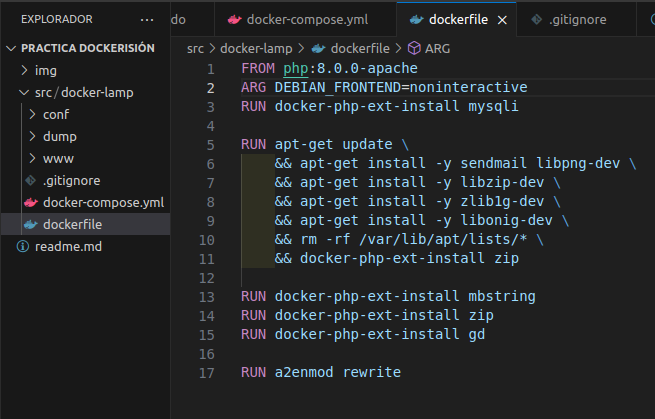
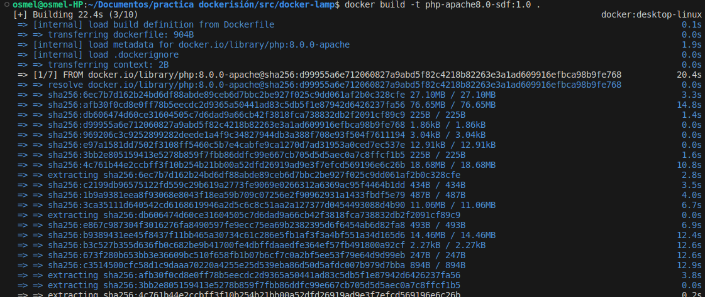
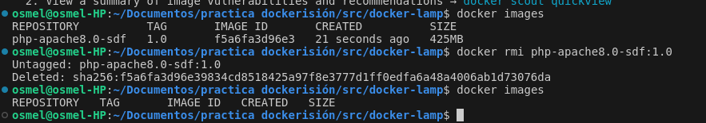
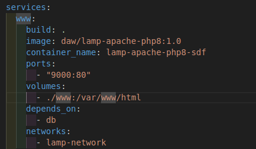
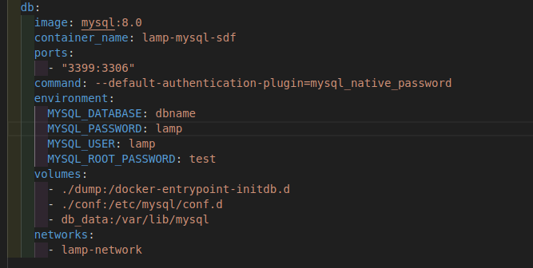
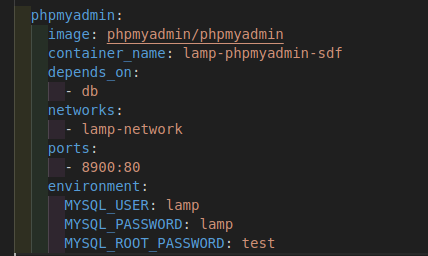
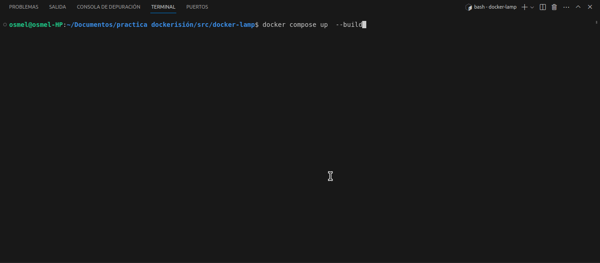
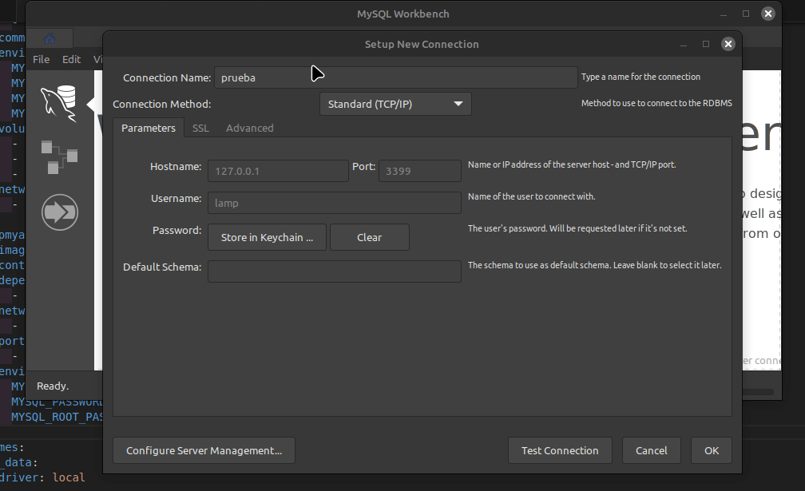
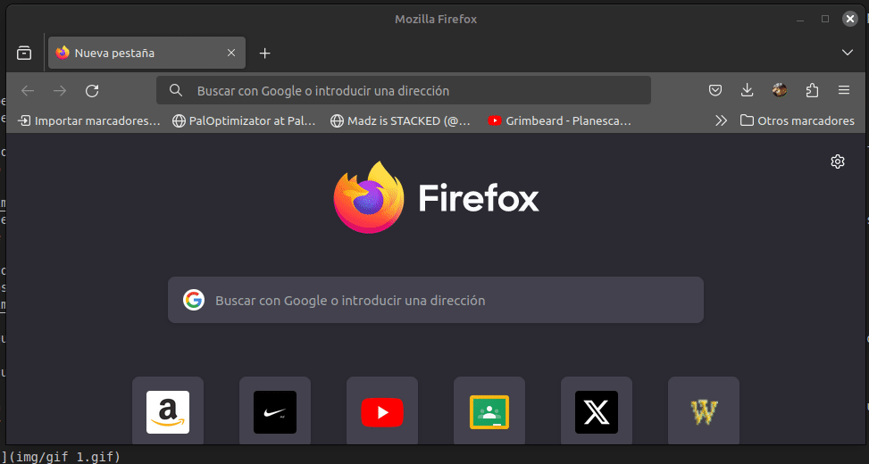
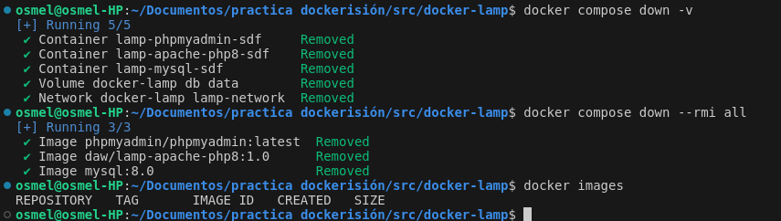

# Práctica de Docker

### Paso 1
 1.- Crear el fichero y la infraestructura requerida

   

 2.- Ahora, tenemos que especificar (o modificar) lo que necesitemos en el dockerfile
    

 3.-¿Para que necesitamos este archivo?

    Este archivo son, por asi decirlo, unas instrucciones-guias de instalacion. 
    Pedimos lo que queremos (PHP), sobre que vamos a ejecutarlo (debian) y que cosas extras necesitariamos. 
    En caso de no usarlo, tendríamos que hacerlo todo manualmente, comando por comando en el docker.
    Haciendo este archivo, creamos una "plantilla" de comandos que cargarán automaticamente todo lo que necesitemos

 4.-Comprobado que todo está a gusto del consumidor, procedemos a crearlo 
    

    El comando para crear la imagen consiste en:
      -La orden *docker build*, que llama al motor y aplica la orden de 
      creacion a partir del dockerfile
      
      -La orden -t que pide que se ejecute de manera interactiva.

      -El nombre y versión de lo que queremos crear
      
      - Un punto . Para indicar que el archivo que buscamos con
      instrucciones está en la misma carpeta

 5.-Y por ultimo, borramos esto.

   

### Paso 2
   1.- Ahora toca configurar el Docker-compose. El docker compose es como un paso más en este tipo de proceso de automatiación, ya que permite una configuración mayor y múltiple. Por ejemplo, en un mismo archivo podemos levantar php, mysql, un debugger...Además de poder especificar para cada uno sus configuraciones (puertos que se usan, carpetas usadas, nombres...). Empezaremos por configurar un servicio www
   
   

      -El comando build implica desde done construir. El punto, como se ha explicado antes, 
      implica que es la misma carpeta

      - IMAGE es el nombre de la imagen que usaremos (es decir, el que queramos). 
      De la misma manera, el contenedor a usar podemos ponerle nombre  en CONTAINER_NAME
      
      -PORTS nos permite configurar que puertos reales corresponden a que 
      puertos del contenedor (en ese orden)

      -VOLUMES permite hacer más o menos lo mismo que PORTS pero con carpeas.
      Permite que el contenedor se comunique con la maquina real y que carpetas les corresponde
   
   2.- Conociendo estas reglas, podemos seguir construyendo nuestro archivo y los demás servicios con sus parámetros. Algunos de ellos tienen parámetros no obligatorios, pero que para este proyecto son necesarios

   
      -En este servicio, por ejemplo, podemos configurar cosas como la base de datos a conectarnos, o nombres y contraseñas para los usuarios, como se ve en MYSQL_ROOT_PASSWORD o MYSQL_USER.

      -Tambien configuramos en NETWORK a que red pertenece nuestro servicio. 
      Todos los servicios que estén en una misma red, pueden comunicarse entre ellos.
   

      -Tenemos que tener en cuenta, que hay una orden llamada DEPENDS. Aqui especificamos que mis servicios 
      SOLO se ejecutarán si los mencionados funcionan. Por ejemplo, si yo inicio todo este servicio, primero
      se ejecutará mysql y después, www y phpadmin. Si mysql falla al iniciar, no se ejecutarán los demás ni
      tampoco puedo ejecutarlos manualmente.
   
   3.-Ahora toca ver que funcione. Levanto todo esto con el modo atacched (es decir, no interactivo. Si fuese inteactivo, tendría que añadir -d al comando) y compruebo que todo se ejecuta bien y hago comprobaciones

      

      

      

      Comprobado que todo funciona, procedemos a eliminar los archivos con 

         -docker compose down -v

         -docker compose down --rmi all

      

